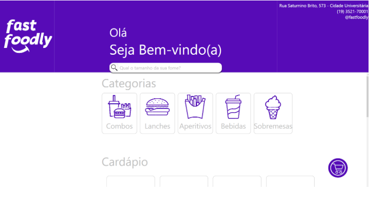

# FastFoodly
Projeto final do Curso Tecnologias Microsoft do Instituto de Computação da Unicamp

## Integrantes
- Breno Cardoso Senna (ex182821)
- Gustavo Borba da Silva (ra237965)
- Sathya de Camargo Andrade Gimenes (ex182686)
- Tiago Perrupato Antunes (ra194058)

## Objetivo
Criar um Cardápio Digital para ser usado em um restaurante Fast Food presencial, que permita o usuário escolher seus produtos e realizar um pedido sozinho.

## Como executar o programa
### Método Github
**Pré-requisito para executar o programa:** 
- Sistema operacional Microsoft Windows 10 ou superior
- .NET Framework 4.7.2 ou superior
#### Passo a Passo
- Clonar o repositório em uma pasta local: ```git clone https://github.com/FastFoodly/FastFoodly.git```
- Abra o projeto com o VS Code ou Visual Studio
- Abra o terminal e verifique se o mesmo encontra-se na pasta ```FastFoodly/```
- Execute o projeto pelo terminal com o comando ```dotnet run```
### Método Executável
- Colocar aqui caso tenha
## Funcionamento do sistema



<br>
No Aplicativo FastFoodly, é possível navegar pelo cardápio do restaurante e escolher alimentos para visualizar ele detalhadamente. Além disso, é possível entrar em abas de categorias para filtrar melhor a escolha do usuário, além de uma barra de pesquisa clássica para ajudar nesse processo de filtragem.

Existe um ícone de Carrinho que permite o usuário acessar seu Carrinho de Compra em qualquer tela do aplicativo, caso ele queira.

Na tela de detalhe do produto, é possível adicionar complementos e colocar observações que o cliente deseja, como retirar um ingrediente, ponto da carne, etc.

Por fim a janela de Carrinho permite o usuário retirar algum item, limpar ou concluir seu pedido.